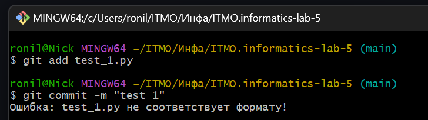
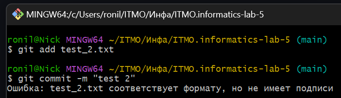
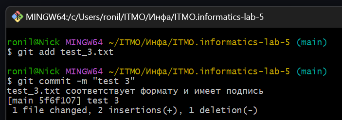

# Отчет по лабораторной работе 5
*Выполнил __Малыхин Никита Сергеевич__* 

# Задание 1

## Цель
Предположим, у вас есть задача автоматизировать проверку формата файлов при коммите с использованием Git Hooks.

Перед каждым коммитом необходимо автоматически проверять, чтобы все .txt файлы в репозитории соответствовали определенному формату.

Создайте bash-скрипт, который будет выполнять проверку того, что коммитится файл формата .txt и в файле присутствует какой-то текст (например, в конце файла есть подпись автора, неважно как она выглядит, главное чтобы была какая-нибудь проверка содержимого файла). Далее поместите этот скрипт в нужную папку и проверьте, что перед каждым коммитом проходит проверка, например, добавьте вывод о результате проверки в консоль. За этот функционал отвечает Git Hooks, там сказазно как автоматизировать такую проверку.


## Создание образа

### 1. Создаем файл pre-commit:
```
#!/bin/bash

for file in $(git diff --cached --name-only); do
    if [[ $file == *.txt ]]; then
        if tail -n 1 "$file" | grep -q "Автор:"; then
            echo "$file соответствует формату и имеет подпись"
        else
            echo "Ошибка: $file соответствует формату, но не имеет подписи"
            exit 1
        fi
    else
        echo "Ошибка: $file не соответствует формату!"
        exit 1
    fi
done

exit 0
```


### 2. Помещаем его в директорию .git/hooks:
```
cp pre-commit .git/hooks
```

### 3. Проверяем результат работы





# Задание 2
1. В корне репозитория выполняем инициализацию Git Flow.

```
git flow init
```

2. Создаем ветку для новой функциональности, допустим она называется "task-management":

```
git flow feature start task-management
```

3. Внесим изменения в код для добавления функционала управления задачами (например, в файл task_manager.py):

```
def create_task(title):
    print(f"Создана новая задача: {title}")
```

Выполняем коммит изменения по мере разработки:

```
git add task_manager.py
git commit -m "Добавлен функционал управления задачами"
```

4. После завершения разработки функции завершаем фичу и объединияем ее с основной веткой:

```
git flow feature finish task-management

```

Git Flow автоматически переключится на ветку develop и выполнит слияние.

5. Переключаемся на ветку "develop" и начните создание релиза:

```
git checkout develop
git flow release start v1.0.0
```

6. Внесим изменения, связанные с релизом (например, обновляем версию в файле version.txt):

```
echo "v1.0.0" > version.txt
git add version.txt
git commit -m "Обновлена версия для релиза v1.0.0"

```

7. Завершаем релиз и объединяем его с ветками "develop" и "main":

```
git flow release finish v1.0.0
```

8. Если в процессе использования выявлена критическая ошибка, создаем hotfix

```
git flow hotfix start hotfix-1.0.1
```

9. Вносим изменения для исправления ошибки и коммитим:

```
# Исправление ошибки
git add file_with_error.py
git commit -m "Исправлена критическая ошибка"
```

10. Завершаем hotfix и объединяем его с ветками "develop" и "main":

```
git flow hotfix finish hotfix-1.0.1
```

11.  Завершаем работу и отправляем изменения на удаленный репозиторий.

```
git push origin develop
git push origin main
```

## Вывод
Был создан репозиторий, была реализована автоматизация проверки формата файлов при коммите, а также сымитировано использование Git Flow в проекте.